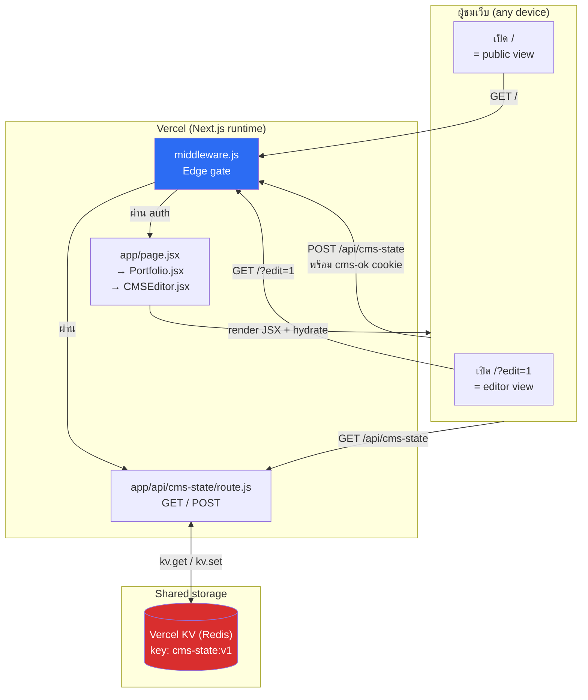
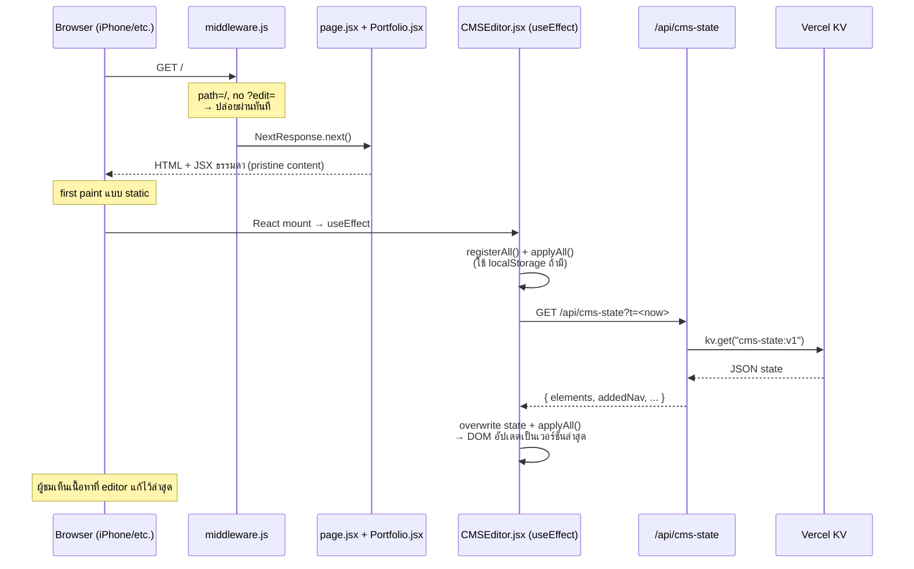
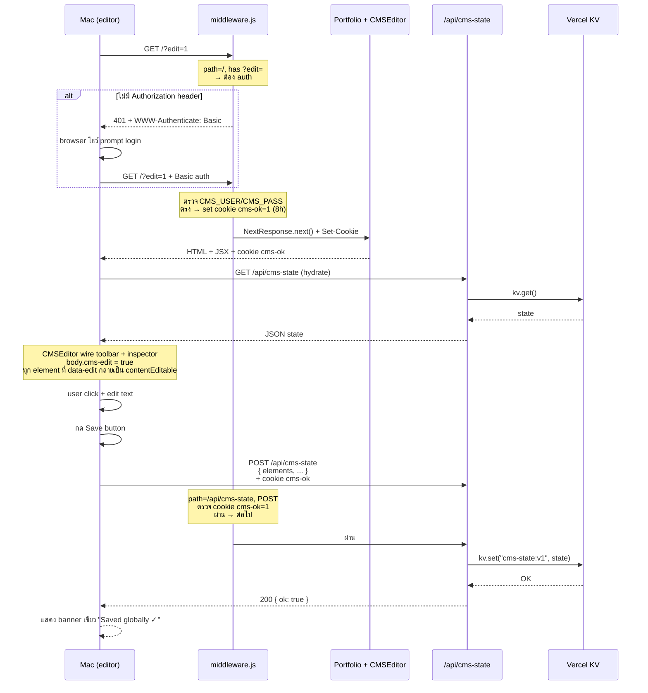
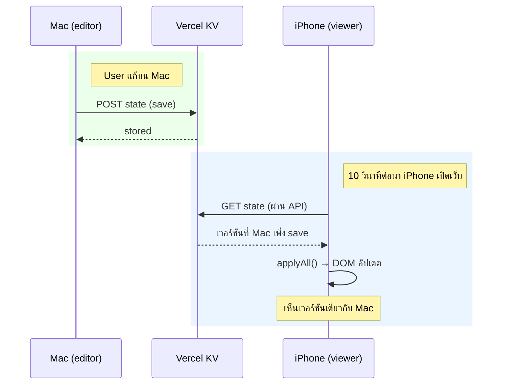
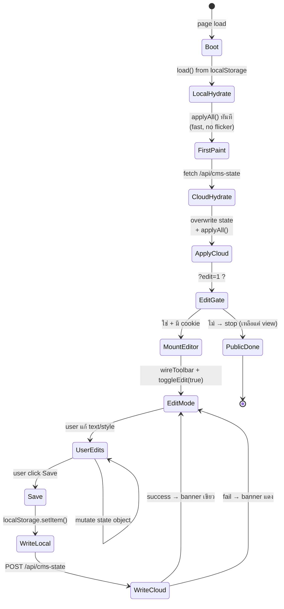

# Passanai Portfolio — Architecture & Code Walkthrough

เอกสารนี้อธิบายโครงสร้างและการทำงานของ portfolio site (https://passanai.vercel.app/) ตั้งแต่บนลงล่าง พร้อม flow diagrams และคำอธิบายรายบรรทัดของโค้ดที่สำคัญ

- **Repo**: https://github.com/B4YM4C/passanai-webport
- **Deploy**: Vercel (auto-deploy on push to `main`)
- **Stack**: Next.js 14 App Router + React 18 + Vercel KV + Vercel Edge Middleware

---

## 1. ภาพรวมสั้นๆ — โปรเจกต์นี้ทำอะไร

เว็บ portfolio สองภาษา (ไทย/อังกฤษ) ที่มี **CMS ในตัว** — เจ้าของเว็บแก้เนื้อหาได้จากหน้าเว็บจริงผ่าน URL ลับ (`/?edit=1`) โดยไม่ต้องแก้โค้ดหรือ redeploy ใหม่ และสิ่งที่แก้จะ **sync ข้ามทุกอุปกรณ์** ผ่าน Vercel KV (Redis) — iPhone / Mac / incognito เห็นเหมือนกัน

**ส่วนประกอบหลัก 4 ส่วน:**

1. **Public site** (`/`) — React SPA ที่ render จาก JSX ธรรมดา ทุกคนเห็น
2. **CMS editor** (`/?edit=1`) — React component เดียวกันแต่ "ติดโหมดแก้" ให้ผู้ใช้ที่ auth ผ่าน
3. **Auth gate** (Edge middleware) — Basic Auth + cookie ป้องกันไม่ให้คนภายนอกเข้า editor
4. **Shared state API** (`/api/cms-state`) — GET อ่าน state ทุกอุปกรณ์ / POST บันทึกเฉพาะ editor ที่ auth แล้ว

---

## 2. ภาพรวมระบบ (High-level diagram)



---

## 3. โครงสร้างไฟล์

```
passanai-webport-main/
├── app/
│   ├── layout.jsx            # <html><body> wrapper + Google Fonts + metadata
│   ├── page.jsx              # หน้าเดียว: render <Portfolio />
│   ├── globals.css           # CSS ทั้งเว็บ (sections + CMS toolbar styles)
│   └── api/
│       └── cms-state/
│           └── route.js      # API: GET อ่าน / POST เขียน state ไปที่ KV
├── components/
│   ├── Portfolio.jsx         # JSX ทุก section ของ portfolio + toolbar DOM
│   ├── CMSEditor.jsx         # Logic ทั้งหมดของ CMS editor (1140 บรรทัด)
│   └── Cinema.jsx            # Background video layer (transparent WebM)
├── public/                   # ไฟล์รูป/วิดีโอ static
├── middleware.js             # Edge middleware — auth gate
├── next.config.mjs           # Next.js config (StrictMode เปิด)
├── package.json              # dependencies
├── push.sh                   # one-liner: commit + push
└── ARCHITECTURE.md           # ไฟล์นี้
```

---

## 4. Flow 1: ผู้ชมทั่วไปเปิดหน้าเว็บ (`/`)



**หัวใจของ flow นี้:** Public view โหลด JSX ธรรมดาก่อน (fast first paint) แล้ว `CMSEditor.jsx` ยิง `fetch('/api/cms-state')` ไปอ่าน state ล่าสุดจาก KV มาซ้อนทับ — ไม่ว่าจะเปิดบน iPhone, incognito หรือเครื่องไหน ก็เห็น version เดียวกันที่เจ้าของเพิ่ง save

---

## 5. Flow 2: เจ้าของเปิด editor + save



**หัวใจของ flow นี้:**
- `middleware.js` คือด่านเดียวที่ตัดสินใจว่าใครเข้า editor ได้บ้าง
- Cookie `cms-ok=1` ใช้ซ้ำในทั้งการเข้า editor UI และการ POST save (ไม่ต้อง prompt login ทุกครั้งที่ save)
- POST จะ write ไป Vercel KV → ทุกผู้ชมคนต่อไปจะเห็นเวอร์ชันใหม่

---

## 6. Flow 3: Cross-device sync



**ทำไมต้องใช้ KV แทน localStorage?** — `localStorage` แยกต่อ browser ต่อเครื่อง แก้บน Mac ไม่มีทางไปถึง iPhone KV คือจุดเดียวที่ทุก client อ่าน/เขียนได้

---

## 7. Flow 4: State lifecycle ภายใน CMSEditor



---

## 8. Line-by-line walkthrough: middleware.js

`middleware.js` คือ Edge runtime function ที่วิ่ง **ก่อน** request ถึงหน้าเพจ ใช้ทำ auth gate

```js
import { NextResponse } from 'next/server';
```
Import helper สำหรับ return response ใน Edge runtime

```js
export function middleware(req) {
  const url = new URL(req.url);
  const { pathname } = url;
  const isDev = process.env.NODE_ENV !== 'production';
```
- `req.url` เป็น absolute URL → แปลงเป็น object เพื่อหา pathname + query string
- `isDev` ใช้ตัดสินใจว่าจะเปิด dev fallback (`dev`/`dev`) หรือไม่ Vercel ตั้ง `NODE_ENV=production` อัตโนมัติ ดังนั้น dev fallback จะไม่ทำงานบน production

```js
  if (pathname === '/api/cms-state') {
    if (req.method === 'GET') return NextResponse.next();
```
- ถ้าเรียก GET `/api/cms-state` → ปล่อยผ่านทันที (ใครก็อ่าน state ได้)

```js
    if (req.method === 'POST') {
      const cookie = req.cookies.get('cms-ok');
      if (cookie && cookie.value === '1') return NextResponse.next();
      return new NextResponse('Unauthorized — open /?edit=1 and sign in first.', {
        status: 401,
      });
    }
```
- ถ้า POST → ต้องมี cookie `cms-ok=1` (ซึ่งจะ set เมื่อ auth ผ่านจาก `/?edit=1`) ไม่มี = 401
- ไม่ prompt basic auth ซ้ำ เพราะ cookie ใช้ได้ 8 ชม.

```js
  const wantsEdit = url.searchParams.has('edit');
  if (!wantsEdit) return NextResponse.next();
```
- ถ้าไม่ใช่ `/api/cms-state` และไม่มี `?edit=` → ปล่อยผ่าน (public view)

```js
  let user = process.env.CMS_USER || '';
  let pass = process.env.CMS_PASS || '';

  if ((!user || !pass) && isDev) {
    user = 'dev';
    pass = 'dev';
  }
```
- อ่าน credentials จาก Vercel env vars ก่อน ถ้าว่างและอยู่ใน dev → ใช้ `dev`/`dev`
- Production จะไม่ได้ dev fallback เด็ดขาด เพราะ `isDev === false`

```js
  const got = req.headers.get('authorization') || '';
  const expected = 'Basic ' + btoa(`${user}:${pass}`);

  if (got === expected) {
    const res = NextResponse.next();
    res.cookies.set('cms-ok', '1', {
      sameSite: 'lax',
      path: '/',
      maxAge: 60 * 60 * 8,
      secure: !isDev,
    });
    return res;
  }
```
- เปรียบเทียบ Basic auth header: header ต้องเป็น `Basic <base64(user:pass)>` เป๊ะ
- ผ่าน → set cookie `cms-ok=1` อายุ 8 ชม.
- `secure: !isDev` — localhost เป็น http ไม่รองรับ secure cookie ต้อง disable

```js
  return new NextResponse('Authentication required', {
    status: 401,
    headers: {
      'WWW-Authenticate': 'Basic realm="Portfolio CMS", charset="UTF-8"',
    },
  });
}

export const config = {
  matcher: ['/', '/api/cms-state'],
};
```
- ไม่ผ่าน → 401 + header `WWW-Authenticate: Basic` → browser เด้ง login prompt ให้เอง
- `config.matcher` บอก Next.js ว่า middleware นี้ทำงานเฉพาะ 2 route เท่านั้น ประหยัด cold start

---

## 9. Line-by-line walkthrough: app/api/cms-state/route.js

API route สำหรับอ่าน/เขียน state ใน Vercel KV

```js
import { NextResponse } from 'next/server';
import { kv } from '@vercel/kv';

export const runtime = 'nodejs';
export const dynamic = 'force-dynamic';
```
- `runtime = 'nodejs'` — ใช้ Node.js runtime (ต้องใช้เพราะ `@vercel/kv` ไม่รองรับ Edge)
- `dynamic = 'force-dynamic'` — บอก Next.js ห้าม cache response (SSG disabled)

```js
const KV_KEY = 'cms-state:v1';
const EMPTY_STATE = { elements: {}, addedNav: [], addedSections: [], deleted: [] };
```
- ชื่อ key ใน Redis — ใช้ `:v1` suffix เผื่อวันหลังเปลี่ยน schema จะได้ up-version ได้
- `EMPTY_STATE` = default เมื่อยังไม่มีใคร save

```js
function kvConfigured() {
  return !!(process.env.KV_REST_API_URL && process.env.KV_REST_API_TOKEN);
}
```
- Helper เช็คว่า Vercel KV ถูก connect แล้วหรือยัง (อิงจาก env vars ที่ Vercel inject อัตโนมัติ)

```js
async function readState() {
  if (!kvConfigured()) return null;
  try {
    const raw = await kv.get(KV_KEY);
    if (!raw) return null;
    if (typeof raw === 'string') {
      try { return JSON.parse(raw); } catch (e) { return null; }
    }
    if (typeof raw === 'object') return raw;
    return null;
```
- `kv.get()` auto-deserialize object → คืน object ตรงๆ
- แต่ถ้าข้อมูลเก่าถูก set เป็น JSON string (legacy) → จะได้ string กลับมา → parse แบบ manual
- ถ้า parse fail → return null ไม่ throw

```js
  } catch (e) {
    console.error('[cms-state] kv read failed', e);
    return null;
  }
}
```
- KV connection error ไม่ทำให้ GET พัง → log + return null → client ได้ empty state → fallback ไปใช้ JSX ธรรมดา

```js
export async function GET() {
  const state = (await readState()) || EMPTY_STATE;
  return new NextResponse(JSON.stringify(state), {
    headers: {
      'Content-Type': 'application/json; charset=utf-8',
      'Cache-Control': 'no-store, no-cache, must-revalidate, max-age=0',
      'CDN-Cache-Control': 'no-store',
      'Vercel-CDN-Cache-Control': 'no-store',
      'Pragma': 'no-cache',
      'Expires': '0',
    },
  });
}
```
- Response headers **กันทุก cache** (browser, proxy, CDN ของ Vercel)
- ถ้าไม่ใส่ `Vercel-CDN-Cache-Control` Vercel Edge อาจ cache response ทำให้ client อื่นเห็นของเก่าเป็นนาที — เคยเป็นปัญหาจริงในเวอร์ชันก่อน

```js
export async function POST(req) {
  if (!kvConfigured()) {
    return NextResponse.json(
      { error: 'KV store not configured...' },
      { status: 503 }
    );
  }
```
- ถ้า KV ยังไม่ได้ set ขึ้น Vercel → 503 พร้อมคำแนะนำ client แสดง banner "Saved locally only" แทน

```js
  let state;
  try {
    state = await req.json();
  } catch (e) {
    return NextResponse.json({ error: 'Invalid JSON body' }, { status: 400 });
  }

  if (!state || typeof state !== 'object' || Array.isArray(state)) {
    return NextResponse.json({ error: 'State must be an object' }, { status: 400 });
  }
```
- Parse body + sanity check ต้องเป็น object เปล่าๆ (ไม่ใช่ array)

```js
  const clean = {
    elements: state.elements && typeof state.elements === 'object' ? state.elements : {},
    addedNav: Array.isArray(state.addedNav) ? state.addedNav : [],
    addedSections: Array.isArray(state.addedSections) ? state.addedSections : [],
    deleted: Array.isArray(state.deleted) ? state.deleted : [],
  };
```
- Whitelist เฉพาะ 4 key ที่เรายอมรับ — กันไม่ให้ใครแอบใส่ field แปลกๆ มาบวม KV

```js
  try {
    await kv.set(KV_KEY, clean);
    return NextResponse.json({ ok: true, bytes: JSON.stringify(clean).length, at: new Date().toISOString() });
  } catch (e) {
    console.error('[cms-state] kv write failed', e);
    return NextResponse.json({ error: 'Write failed: ' + e.message }, { status: 500 });
  }
}
```
- `kv.set()` เขียนทับทั้ง key → การ save ครั้งหลังเหนือครั้งก่อนเสมอ (ไม่มี merge/patch)
- Response ส่ง `bytes` กลับไปด้วย เพื่อช่วย debug ว่า state โตเกินไปไหม

---

## 10. Line-by-line walkthrough: CMSEditor.jsx (ส่วนหลัก)

CMSEditor เป็น client component ขนาด 1140 บรรทัด ทำหน้าที่ทุกอย่างของ CMS: register elements, apply edits, toolbar UI, inspector panel, save to cloud ต่อไปอธิบายเฉพาะส่วนที่ critical

### 10.1 Component shell

```js
'use client';
import { useEffect } from 'react';

export default function CMSEditor() {
  useEffect(() => {
    // ทุกอย่างอยู่ใน useEffect เดียว
    // ...
  }, []);
  return null;  // ไม่ render อะไรเลย — ทุกอย่างทำผ่าน DOM ตรงๆ
}
```
- `'use client'` → บอก Next.js ว่า component นี้ hydrate บน browser
- `return null` → ไม่มี JSX เพราะทำงานผ่านการ mutate DOM ที่ Portfolio.jsx สร้างไว้

### 10.2 State object

```js
const LS_KEY = 'cms-portfolio-v1';
const CLOUD_URL = '/api/cms-state';
const state = load() || { elements: {}, addedNav: [], addedSections: [], deleted: [] };
```
- `state` ถูก mutate ตลอด (พอ user แก้ text/style → update `state.elements[key]` ตรงๆ)
- 4 field:
  - `elements` — map `CSS selector string` → `{ text, style, html, art }`
  - `addedNav` — array nav link ที่ user เพิ่มใหม่
  - `addedSections` — array section ที่ user spawn ใหม่
  - `deleted` — array key ที่ user กด Delete

### 10.3 hydrateFromCloud()

```js
async function hydrateFromCloud() {
  try {
    const bust = Date.now();
    const res = await fetch(CLOUD_URL + '?t=' + bust, {
      cache: 'no-store',
      headers: { 'Cache-Control': 'no-store' },
    });
    if (!res.ok) return;
    const cloud = await res.json();
    if (!cloud || typeof cloud !== 'object') return;
    state.elements = cloud.elements || {};
    state.addedNav = cloud.addedNav || [];
    state.addedSections = cloud.addedSections || [];
    state.deleted = cloud.deleted || [];
    try { localStorage.setItem(LS_KEY, JSON.stringify(state)); } catch (e) {}
    if (typeof applyAll === 'function') applyAll();
  } catch (e) {
    console.warn('[cms] cloud hydrate skipped:', e.message);
  }
}
```
- `?t=<timestamp>` เป็น cache-buster — กัน browser cache + intermediate proxy
- อ่าน cloud → overwrite state → re-apply DOM
- Sync กลับ localStorage ด้วย → ครั้งถัดไปที่ offline ก็ยังเห็นล่าสุด
- ถ้า fail silent (console.warn) ไม่ break UI

### 10.4 save()

```js
async function save() {
  try {
    localStorage.setItem(LS_KEY, JSON.stringify(state));  // offline backup ก่อน
  } catch (e) {
    status('Local save failed: ' + e.message, true);
    return;
  }

  status('Saving to cloud…');

  try {
    const res = await fetch(CLOUD_URL, {
      method: 'POST',
      credentials: 'include',  // ส่ง cookie cms-ok ไปด้วย
      headers: { 'Content-Type': 'application/json' },
      body: JSON.stringify(state),
    });
    if (res.ok) {
      showBigBanner('Saved globally ✓', 'Live on / for every visitor now');
      return;
    }
    if (res.status === 503) {
      showBigBanner('Saved locally only', 'KV store not set up yet', true);
      return;
    }
    throw new Error(res.status);
  } catch (e) {
    showBigBanner('Cloud save FAILED (kept locally)', e.message, true);
  }
}
```
- ขั้นตอน: local → cloud → banner feedback
- `credentials: 'include'` บังคับให้ส่ง cookie (same-origin)
- Error handling แบ่งเป็น 3 กรณี: ok / 503 (KV ไม่ตั้ง) / อื่นๆ (fail แต่ localStorage ยังอยู่)

### 10.5 registerAll() + applyAll()

```js
const EDITABLE_SELECTORS = [
  { sel: 'h1,h2,h3,h4', kind: 'text' },
  { sel: 'p', kind: 'text' },
  // ...
];

function registerAll() {
  EDITABLE_SELECTORS.forEach(({ sel, kind }) => {
    $$(sel).forEach((el) => {
      if (el.hasAttribute('data-edit')) return;
      if (el.closest('.cms-toolbar, .cms-inspector, .cms-status')) return;
      el.setAttribute('data-edit', kind);
      el.setAttribute('data-edit-id', uid());
      el.setAttribute('data-edit-kind', kind);
    });
  });
}
```
- วน selector ทั้งหมด → ติด `data-edit`, `data-edit-id`, `data-edit-kind` บน DOM node
- ข้าม element ที่อยู่ใน toolbar/inspector (ห้ามแก้ตัวเอง)
- `uid()` เป็น runtime-random id (เปลี่ยนทุก page load) ใช้แค่ internal reference

```js
function applyAll() {
  Object.entries(state.elements || {}).forEach(([selKey, data]) => {
    const el = findByKey(selKey);
    if (!el) return;
    applyTo(el, data);
  });

  (state.deleted || []).forEach((k) => {
    const el = findByKey(k);
    if (el) el.style.display = 'none';
  });

  (state.addedNav || []).forEach((n) => { /* inject <a> into navLinks */ });
  (state.addedSections || []).forEach((s) => { /* spawnSection */ });

  registerAll();  // รีเช็ค selectors หลัง DOM เปลี่ยน
}
```
- เดินทุก entry ใน state → หา DOM node จาก key → patch
- Key คือ CSS selector string เช่น `body>main>section.about>h2` (stable across reloads)

### 10.6 keyFor() — stable persistence key

```js
function keyFor(el) {
  return pathOf(el);  // CSS selector chain
}

function pathOf(el) {
  const parts = [];
  for (let n = el; n && n.nodeType === 1 && n.tagName !== 'BODY'; n = n.parentElement) {
    let s = n.tagName.toLowerCase();
    if (n.id) { s += '#' + n.id; parts.unshift(s); break; }
    const cls = (n.className || '').toString().trim().split(/\s+/).filter(Boolean);
    if (cls.length) s += '.' + cls[0];
    // add :nth-of-type if ambiguous
    parts.unshift(s);
  }
  return 'body>' + parts.join('>');
}
```
- สร้าง key เป็น CSS selector เช่น `body>main>section.about>h2`
- **critical**: key ต้องคงที่ข้าม reload — ไม่อย่างนั้น save แล้ว load กลับมาหา element ไม่เจอ (บั๊กเมื่อก่อนใช้ `data-edit-id` ที่ random ทุก load)

### 10.7 boot() — entry point

```js
function boot() {
  // Step 1: instant paint จาก localStorage
  registerAll();
  applyAll();

  // Step 2: fetch cloud → overwrite → re-apply
  hydrateFromCloud();

  // Step 3: ?edit=1 gate
  const sp = new URLSearchParams(location.search);
  if (sp.get('edit') !== '1') return;
  const authed = /(?:^|;\s*)cms-ok=1(?:;|$)/.test(document.cookie);
  if (!authed) return;

  // Step 4: mount editor UI
  wireToolbar();
  wireInspector();
  showToolbar();
  document.addEventListener('click', onDocClick, true);
  // ...
  toggleEdit(true);
  window.addEventListener('beforeunload', save);
}
```
- Step 1-2 ทำทุก visit (public + editor) — public แค่ได้เห็นเนื้อหาล่าสุด
- Step 3-4 เฉพาะ editor view + auth ผ่าน
- `addEventListener('click', onDocClick, true)` — capture phase เพื่อดัก click ก่อนถึง link target (กัน nav ไปหน้าอื่นตอน edit mode)

### 10.8 wireToolbar() — idempotent

```js
function wireToolbar() {
  $('#cmsToggleEdit').onclick = () => toggleEdit();
  $('#cmsSave').onclick = save;
  $('#cmsReset').onclick = () => { /* ... */ };
  $('#cmsAddSection').onclick = () => { /* ... */ };
  $('#cmsAddNav').onclick = () => { /* ... */ };
  $('#cmsExport').onclick = exportHtml;

  setupToolbarDrag();
}
```
- ใช้ `.onclick = fn` **แทน** `addEventListener('click', fn)` — เพราะ React StrictMode เรียก useEffect ซ้ำใน dev ทำให้ handler ซ้อนกันและ click ทีเดียวสลับสองรอบ (toggle ดูเหมือนไม่ทำงาน)
- `.onclick = fn` คือ property assignment — set ใหม่ = overwrite เก่า

### 10.9 Drag toolbar

```js
function setupToolbarDrag() {
  const bar = $('#cmsToolbar');
  const handle = bar.querySelector('.cms-title');
  const POS_KEY = 'cms-toolbar-pos-v1';

  // Restore saved position
  try {
    const { left, top } = JSON.parse(localStorage.getItem(POS_KEY));
    clampAndPlace(left, top);
  } catch (e) {}

  function onDown(e) {
    const point = e.touches ? e.touches[0] : e;
    const rect = bar.getBoundingClientRect();
    offX = point.clientX - rect.left;
    offY = point.clientY - rect.top;
    dragging = true;
  }
  function onMove(e) {
    if (!dragging) return;
    const point = e.touches ? e.touches[0] : e;
    clampAndPlace(point.clientX - offX, point.clientY - offY);
  }
  function onUp() {
    if (!dragging) return;
    dragging = false;
    const rect = bar.getBoundingClientRect();
    localStorage.setItem(POS_KEY, JSON.stringify({ left: rect.left, top: rect.top }));
  }
  handle.onmousedown = onDown;
  handle.ontouchstart = onDown;
  window.onmousemove = onMove;
  window.onmouseup = onUp;
  window.ontouchmove = onMove;
  window.ontouchend = onUp;
}
```
- รองรับทั้ง mouse + touch (iPad/iPhone)
- `clampAndPlace()` clamp พิกัดให้ไม่หลุดขอบจอ
- ตำแหน่ง save localStorage (per-browser — ไม่ sync ข้ามเครื่อง)

---

## 11. Line-by-line walkthrough: Portfolio.jsx (โครงเท่านั้น)

Portfolio.jsx = 1130 บรรทัดของ JSX ทั้ง section + CMS DOM โครงหลัก:

```jsx
export default function Portfolio() {
  const [lang, setLang] = useState('en');  // toggle EN/TH
  return (
    <>
      <Cinema />  {/* video background layer */}
      <nav id="navLinks">...</nav>
      <main>
        <section id="hero" className="hero">...</section>
        <section id="about" className="about">...</section>
        <section id="skills" className="skills">...</section>
        <section id="experience" className="experience">...</section>
        <section id="education" className="education">...</section>
        <section id="certs" className="certs">...</section>
      </main>
      <footer>...</footer>

      {/* CMS DOM — hidden ถ้าไม่มี body.cms-ready */}
      <div className="cms-toolbar" id="cmsToolbar">
        <span className="cms-title">CMS · <b>Edit mode</b></span>
        <button id="cmsToggleEdit" className="primary">Edit: OFF</button>
        <button id="cmsAddSection">+ Section</button>
        <button id="cmsAddNav">+ Nav link</button>
        <button id="cmsSave">Save</button>
        <button id="cmsExport">Export HTML</button>
        <button id="cmsReset" className="danger">Reset</button>
      </div>
      <div className="cms-inspector">...</div>
      <div className="cms-status" id="cmsStatus"></div>

      <CMSEditor />
    </>
  );
}
```

- **Public viewers** — CMS DOM อยู่ใน HTML แต่ CSS ซ่อนไว้ (`.cms-toolbar { display: none }` ถ้า body ไม่มี class `cms-ready`)
- **Editor** — `CMSEditor.jsx` เพิ่ม class `cms-ready` + `cms-edit` บน body → CSS เผย toolbar และทำให้ element contentEditable ได้

---

## 12. CSS สำคัญใน globals.css

```css
/* Toolbar: hidden by default, flex when editor is ready */
.cms-toolbar { display: none; position: fixed; top: 14px; right: 14px; ... }
body.cms-ready .cms-toolbar { display: flex; }

/* Dragging state */
.cms-toolbar.cms-dragging { opacity: .92; cursor: grabbing !important; }
.cms-toolbar .cms-title { cursor: grab; }
.cms-toolbar .cms-title::before { content: "⠿"; }  /* drag handle icon */

/* Make elements editable only when body is in edit mode */
body.cms-edit [data-edit='text'] {
  outline: 1px dashed rgba(0,0,0,.2);
  cursor: text;
}
body.cms-edit [data-edit].cms-selected {
  outline: 2px solid var(--cms-accent);
}

/* Hide CMS elements in print + on public export */
@media print {
  .cms-toolbar, .cms-inspector, .cms-status { display: none !important; }
}
```

---

## 13. Setup checklist (เริ่มจากศูนย์)

1. **Clone repo**
   ```
   git clone https://github.com/B4YM4C/passanai-webport.git
   cd passanai-webport
   ```

2. **ติดตั้ง deps**
   ```
   npm install
   ```

3. **Local dev**
   ```
   npm run dev
   ```
   เปิด http://localhost:3000 — public view
   เปิด http://localhost:3000/?edit=1 — editor (user: `dev`, pass: `dev`)

4. **Deploy to Vercel (ครั้งแรก)**
   - สร้างโปรเจกต์ใหม่บน Vercel → connect GitHub repo `B4YM4C/passanai-webport`
   - Vercel จะ auto-detect Next.js

5. **ตั้ง env vars บน Vercel**
   - Settings → Environment Variables
   - `CMS_USER` = `admin` (หรืออะไรก็ได้)
   - `CMS_PASS` = random string ยาวๆ
   - เลือก scope ทั้ง Production + Preview + Development

6. **สร้าง Vercel KV (จำเป็นสำหรับ cross-device sync)**
   - Dashboard → Storage → Create Database → **KV** (Redis by Upstash)
   - ตั้งชื่อ → Create → Connect to Project
   - Vercel auto-add env vars: `KV_URL`, `KV_REST_API_URL`, `KV_REST_API_TOKEN`, `KV_REST_API_READ_ONLY_TOKEN`

7. **Push**
   ```
   ./push.sh "first deploy"
   ```
   Vercel auto-build → live ใน 1-2 นาที

---

## 14. Troubleshooting

**ปัญหา: Save เห็นบน Mac แต่ไม่เห็นบน iPhone/incognito**
- เช็คว่า Vercel KV ถูก create แล้ว (Storage tab)
- เช็ค env var `KV_REST_API_TOKEN` ถูก set ครบทั้ง 3 environments (Prod/Preview/Dev)
- เช็ค DevTools → Network → `/api/cms-state` ได้ 200 + body มี edits

**ปัญหา: Toggle button ไม่ทำงานใน `npm run dev`**
- เป็นพฤติกรรมของ React StrictMode ที่ mount ซ้ำใน dev
- ต้องใช้ `.onclick = fn` (assigned property) ไม่ใช่ `addEventListener`
- ถ้ายังเจอ — restart dev server

**ปัญหา: `.git/index.lock: File exists`**
- `find .git -name "*.lock" -delete` แล้วลองใหม่

**ปัญหา: 401 ตอนเปิด `/?edit=1`**
- เช็ค `CMS_USER` + `CMS_PASS` บน Vercel
- ลอง incognito + ใส่ password ใหม่ (cookie เก่าอาจหมดอายุ)

**ปัญหา: เห็น 503 "KV store not configured"**
- ยังไม่ได้สร้าง KV หรือ env vars ไม่ครบ
- Storage → Create Database → KV → Connect to Project → Redeploy

---

## 15. สรุปความเป็นเจ้าของข้อมูล

| ข้อมูล | เก็บที่ไหน | เข้าถึงได้โดย |
|---|---|---|
| HTML/CSS/JS ต้นฉบับ | GitHub repo | คนทั่วไป (repo public) |
| CMS state (JSON) | Vercel KV | Vercel project members + เจ้าของ + /api/cms-state endpoint |
| CMS auth creds | Vercel env vars | Vercel project owner เท่านั้น |
| Toolbar position | User's localStorage | เฉพาะ browser นั้นๆ |
| Session cookie | User's browser | เฉพาะ browser นั้นๆ (8 ชม.) |

---

**เอกสารนี้เป็น snapshot ณ commit `246854e` + KV migration** หากโค้ดเปลี่ยนในอนาคตควรอัปเดต section ที่เกี่ยวข้องด้วย
